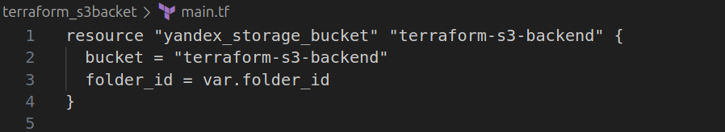
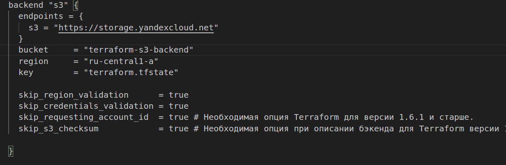

Создание облачной инфраструктуры на базе облачного провайдера Яндекс Облако.

Директория terraform_s3backet

1. Создадим сервисный аккаунт согласно документаци YC:
https://yandex.cloud/ru/docs/iam/quickstart-sa

2. Создадим S3-бакета для хранения terraform-backend

-----------------------------------------------------------------------------
Создание Kubernetes кластера

Директория terraform_backend

1. Добавим в конфигурационный файл настройки бэкенда:

2. Согласно документации яндекс:

https://yandex.cloud/ru/docs/tutorials/infrastructure-management/terraform-state-storage?ysclid=mc7q0g9zbh595529103

Создадим авторизованный ключ для сервисного аккаунта и запись его файл:
yc iam key create \
  --service-account-id ajes5sin2ube284855h7 \
  --folder-name default-katalog \
  --output mykey.json

  
  
Добавим в переменные окружения идентификатор ключа и секретный ключ:

export ACCESS_KEY="..."
export SECRET_KEY="..."

В папке с конфигурационным файлом выполним команды:
terraform init -backend-config="access_key=$ACCESS_KEY" -backend-config="secret_key=$SECRET_KEY"

3. Создадим VPC с подсетями в разных зонах доступности.

[VPC](terraform_backend/network.tf)

4. С помощью сервиса сервисом Yandex Managed Service for Kubernetes создадим кластер k8s.

[Master_node](terraform_backend/master.tf)

[Worker_nodes](terraform_backend/workers.tf)

Чтобы получить доступ к кластеру воспользуемся утилитой yc:

yc managed-kubernetes cluster \
   get-credentials yc-cluster \
   --external --force

-----------------------------------------------------------------------------
Создание тестового приложения

-----------------------------------------------------------------------------
Подготовка cистемы мониторинга и деплой приложения

-----------------------------------------------------------------------------
Установка и настройка CI/CD

