I. Создание облачной инфраструктуры на базе облачного провайдера Яндекс Облако.

Директория terraform_s3backet

1. Создадим сервисный аккаунт согласно документаци YC:
https://yandex.cloud/ru/docs/iam/quickstart-sa

2. Создадим S3-бакета для хранения terraform-backend

terraform init

terraform apply

-----------------------------------------------------------------------------
II. Создание Kubernetes кластера

Директория terraform_backend

1. Добавим в конфигурационный файл настройки бэкенда:

2. Согласно документации YC:

https://yandex.cloud/ru/docs/tutorials/infrastructure-management/terraform-state-storage?ysclid=mc7q0g9zbh595529103

Создадим авторизованный ключ для сервисного аккаунта и запись его файл:

yc iam key create --service-account-id ajes5sin2ube284855h7 --folder-name default-katalog --output mykey.json

  
Добавим в переменные окружения идентификатор ключа и секретный ключ:

export ACCESS_KEY="..."

export SECRET_KEY="..."

В папке с конфигурационным файлом выполним команды:

terraform init -backend-config="access_key=$ACCESS_KEY" -backend-config="secret_key=$SECRET_KEY"

3. Создадим VPC с подсетями в разных зонах доступности.

[VPC](terraform_backend/network.tf)

4. С помощью сервиса Yandex Managed Service for Kubernetes создадим кластер k8s.

[Master_node](terraform_backend/master.tf)

[Worker_nodes](terraform_backend/workers.tf)

Применим манифесты:

terraform apply

Чтобы получить доступ к кластеру воспользуемся утилитой yc:

yc managed-kubernetes cluster get-credentials yc-cluster --external --force

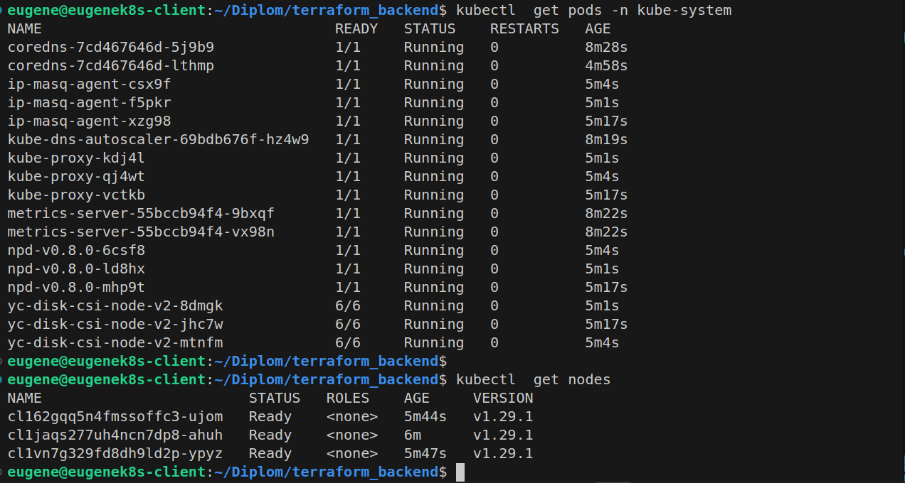

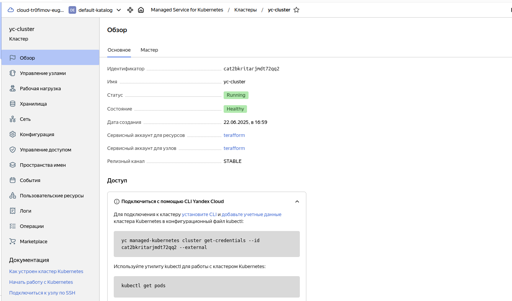

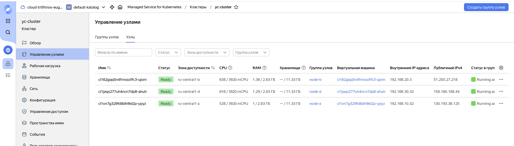

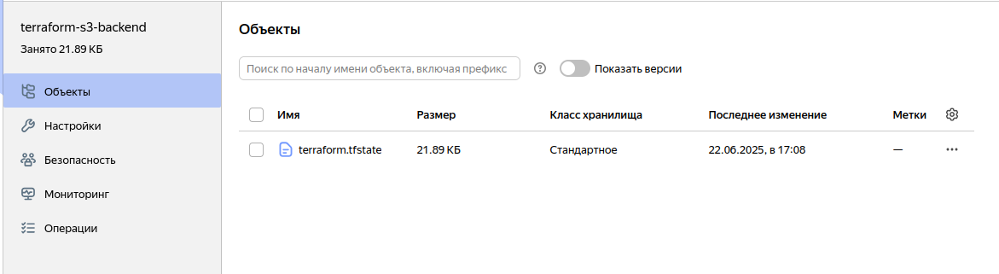

-----------------------------------------------------------------------------

III. Создание тестового приложения

Директория myapp

[Dockerfile](myapp/Dockerfile)

Собранные образы хранятся в:

https://hub.docker.com/repository/docker/eugene513/cicd/general

-----------------------------------------------------------------------------
IV. Подготовка cистемы мониторинга и деплой приложения

Директория monitoring

Воспользуюсь пакетом https://github.com/prometheus-operator/kube-prometheus

git clone git@github.com:prometheus-operator/kube-prometheus.git

kubectl apply --server-side -f manifests/setup
kubectl wait \
    --for condition=Established \
    --all CustomResourceDefinition \
    --namespace=monitoring
kubectl apply -f manifests/

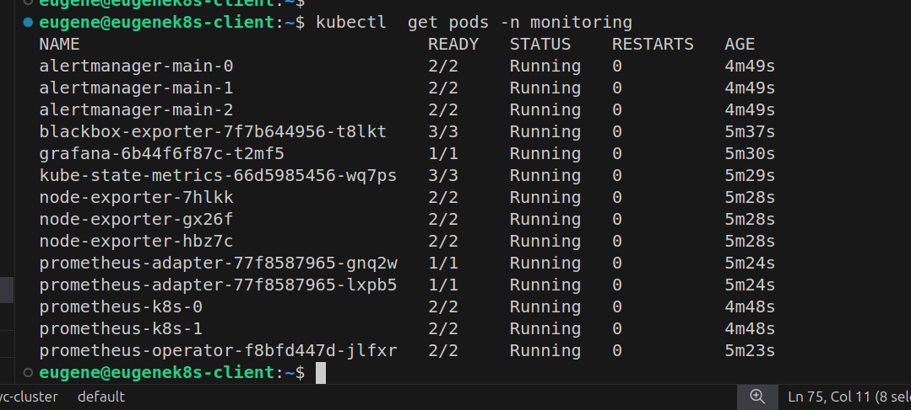

Выполним Port-Forward:
eugene@eugenek8s-client:~$ kubectl port-forward -n monitoring pods/grafana-6b44f6f87c-t2mf5 3000:3000

Forwarding from 127.0.0.1:3000 -> 3000
Forwarding from [::1]:3000 -> 3000

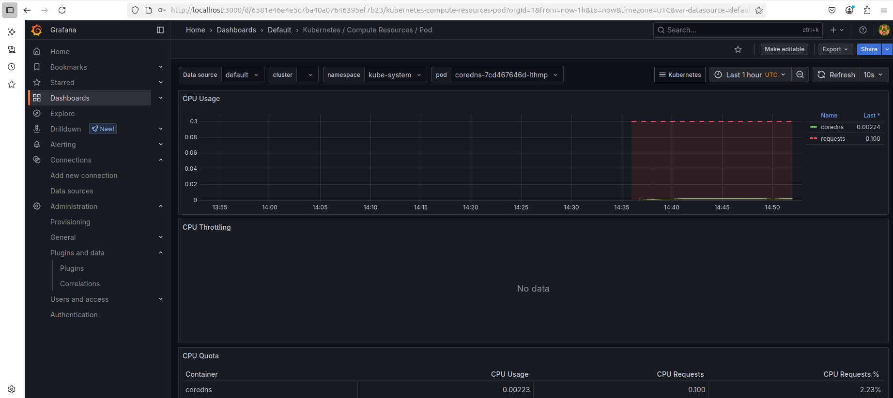

-----------------------------------------------------------------------------
V. Установка и настройка CI/CD

Директория cicd

Для CICD использовался GitHub Actions в отдельном репозитории:
https://github.com/EugeneT81/cicd

Необходимо настроить переменные и secrets в Actions.

Для автоматической сборки приложения в Docker-образ и публикации его в Docker Registry был написан GitHub Action Workflow [my_build.yml](cicd/.github/workflows/my_build.yml)

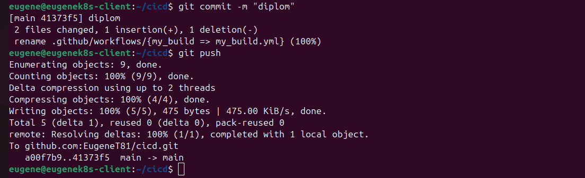

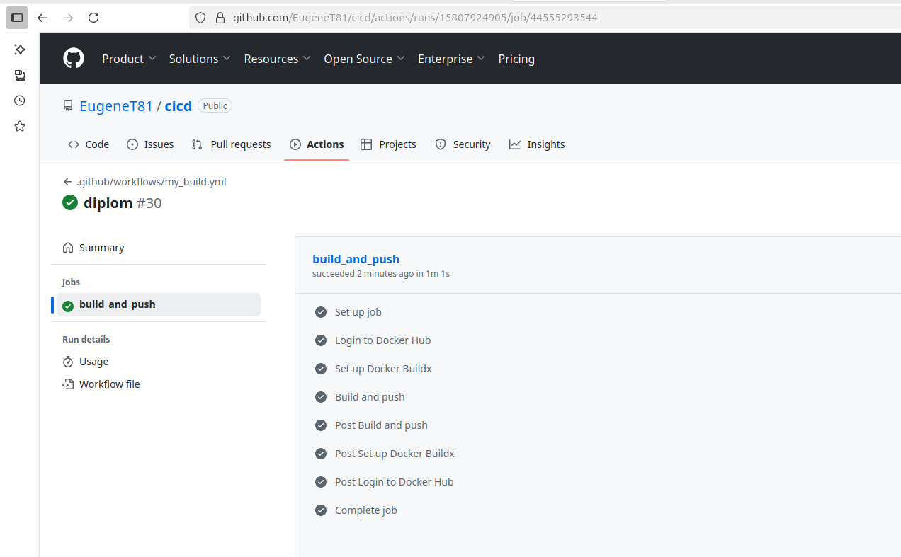

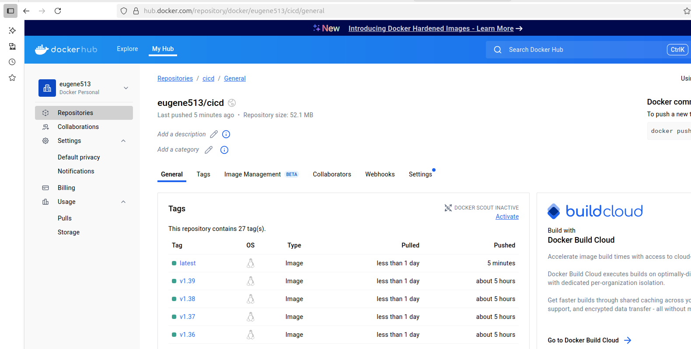

Для деплоя тестового приложения написан манифест [my_depl.yml](cicd/.github/workflows/my_depl.yml)

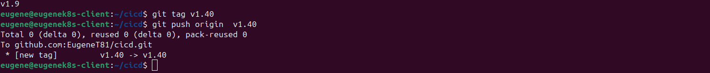

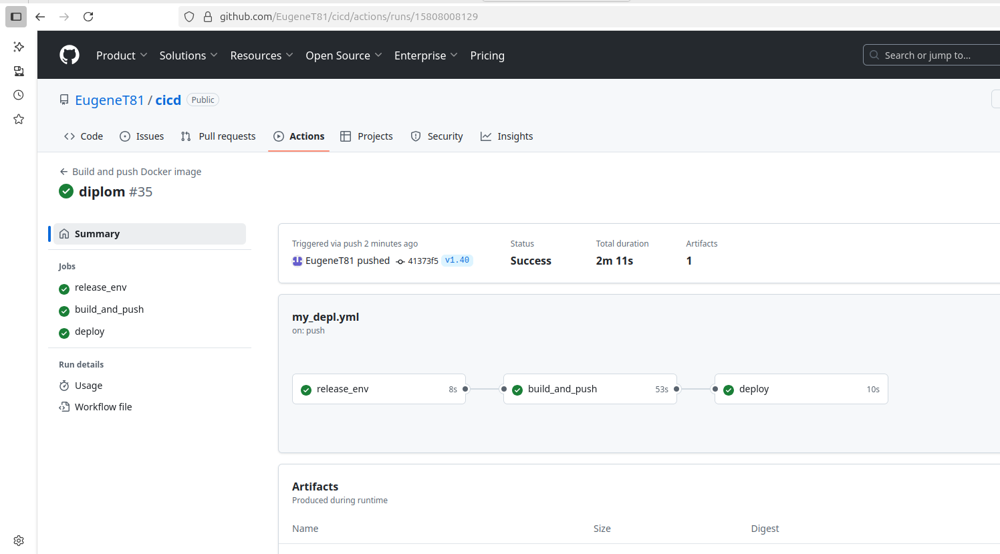

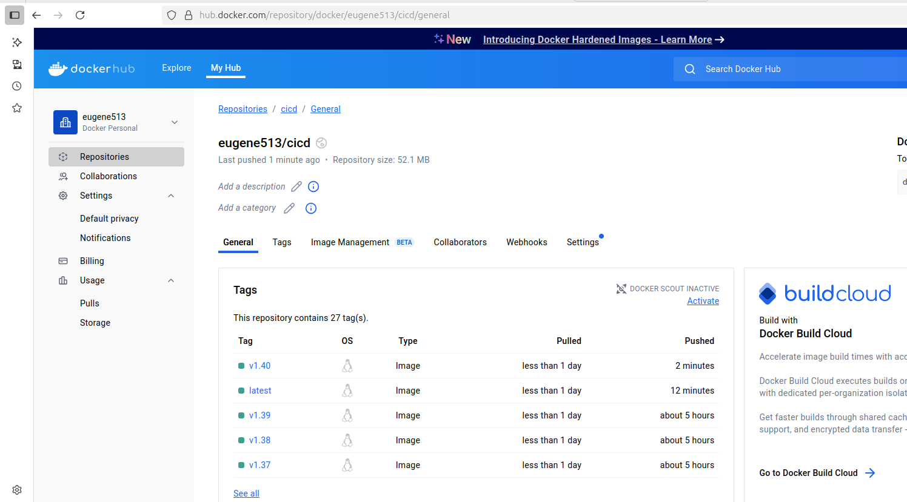

После деплоя приложения можем перейти по адресу http://<node_ip>:30080 и убедиться, что приложение работает.

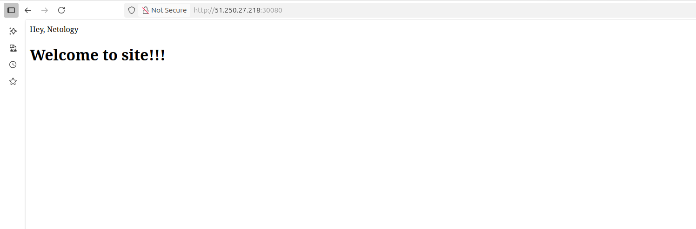

Вывод kubectl get pods и kubectl get svc:

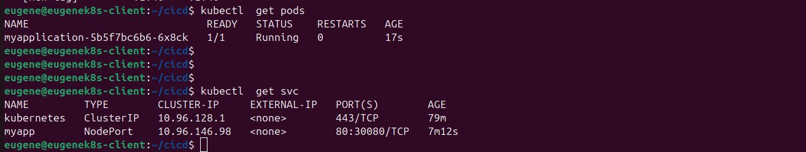

Развернутое приложение мониторится:

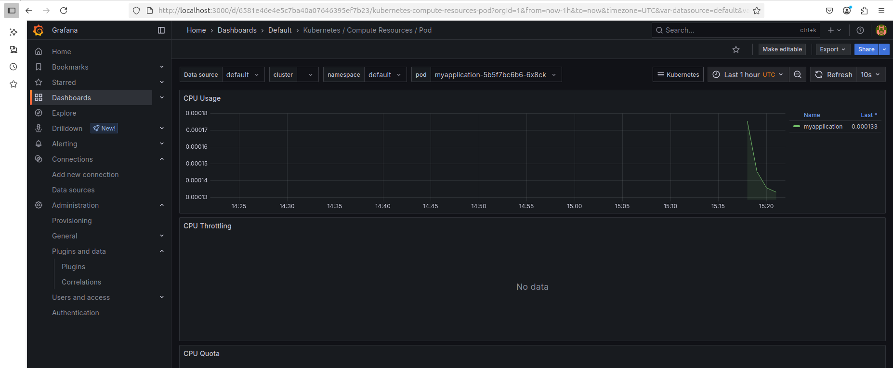

